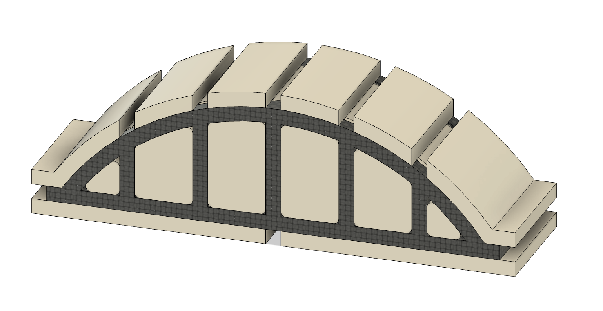
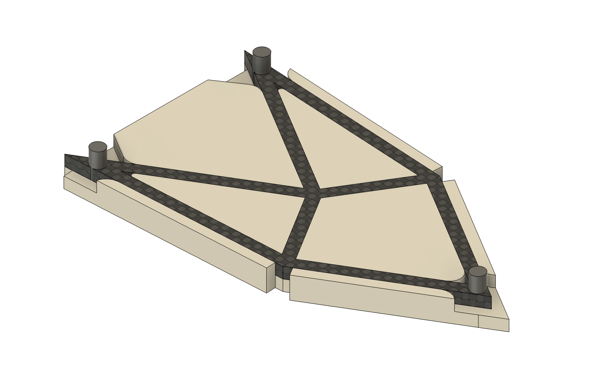
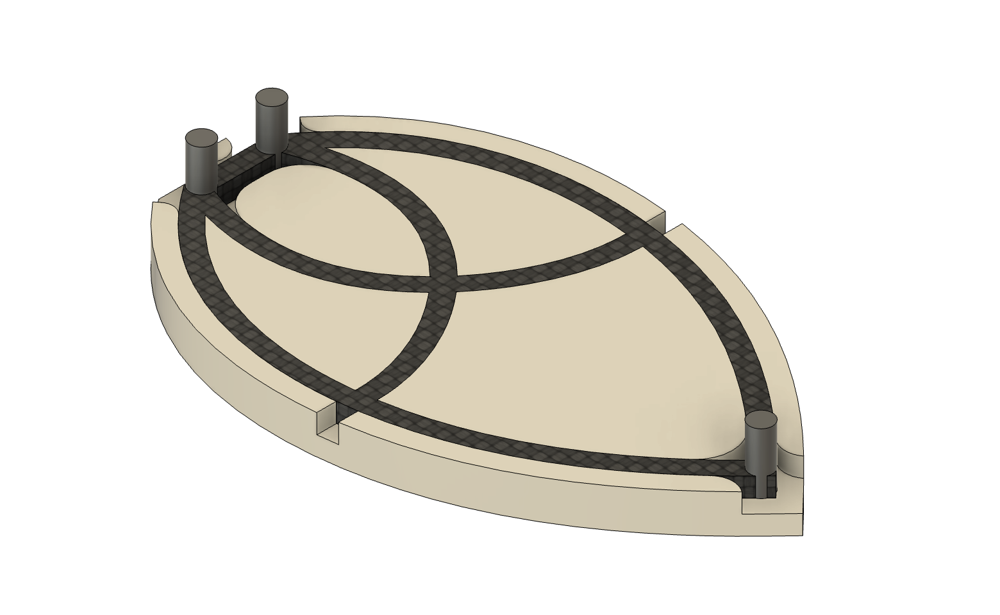
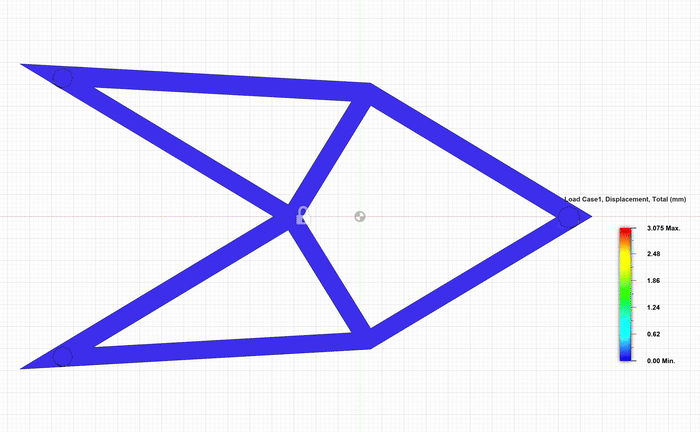
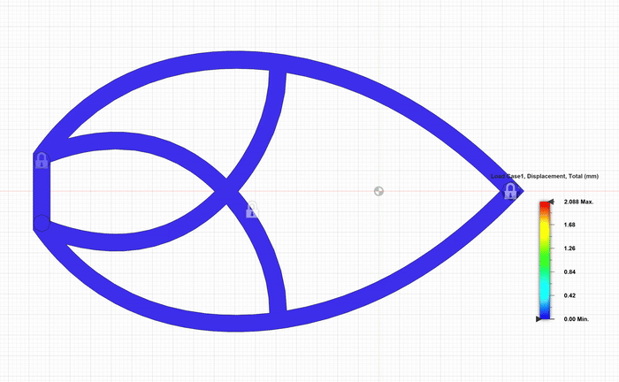
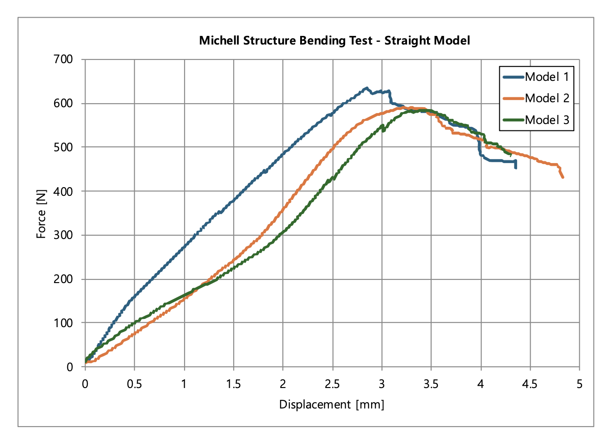
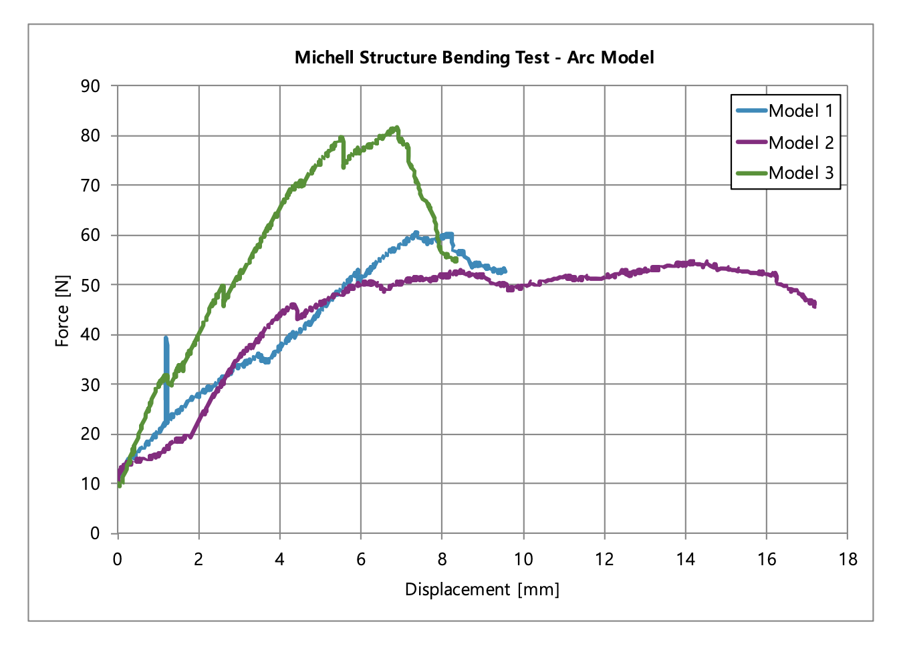

## 📍 Introduction

### Project Introduction
**tapeWinder** is a project focused on the design, fabrication, and testing of composite structures using prepreg tape winding.
I started by sketching the initial structure and designed custom molds for winding. These molds were 3D printed using water-soluble Aquaprint filament.
After winding the prepreg tape onto the molds, I evaluated the prototypes and iterated the design to improve structural performance.
The final models were analyzed through CAE simulations and validated with real-world bending tests.

## 💡 Preview

### are bridge model

### michell models

## 📊 Results

### CAE simulations

### bending test results

## ⚒️ Tools
- **Fusion 360**: CAD modeling, CAE simulations
- **Aquaprint filament + 3D printer**: Mold fabrication
- **Prepreg tape**: Composite winding material  
- **Mechanical test setup**: Bending test validation

## 👩🏻‍💻 Author
Eunsori Cho, [@solheeing](https://github.com/solheeing)
