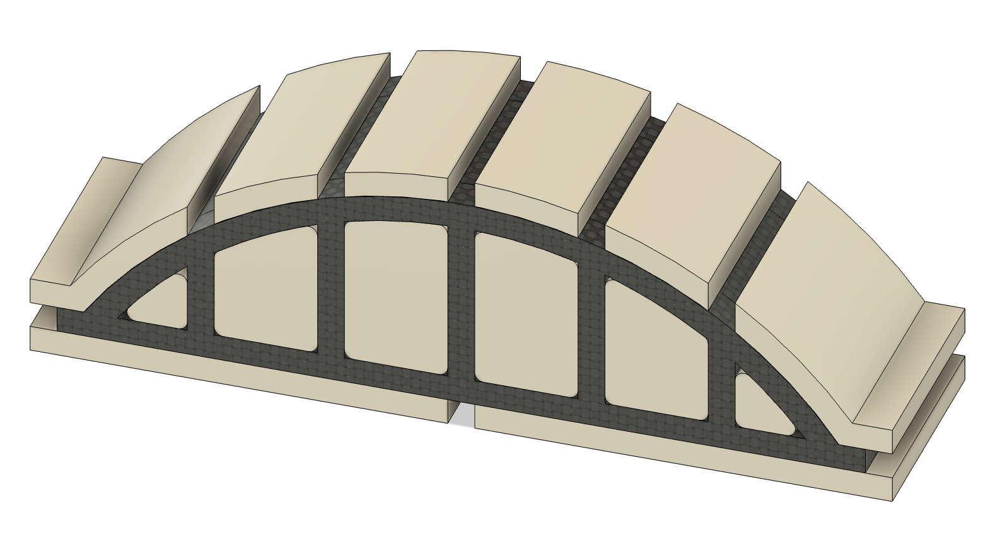
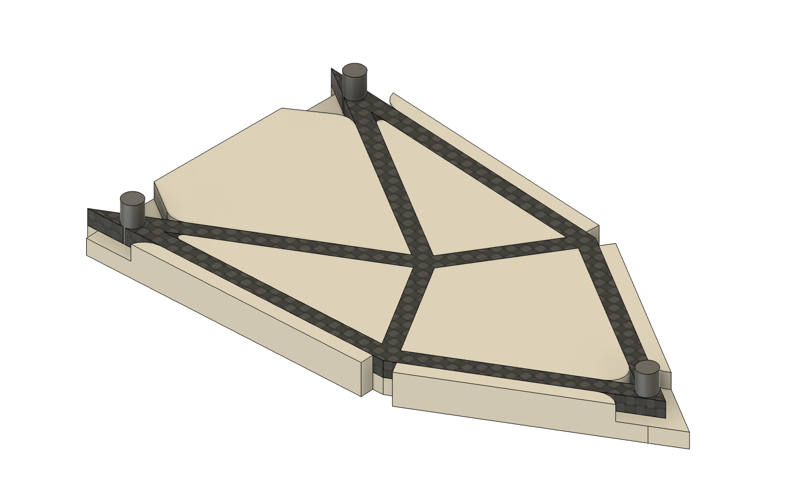
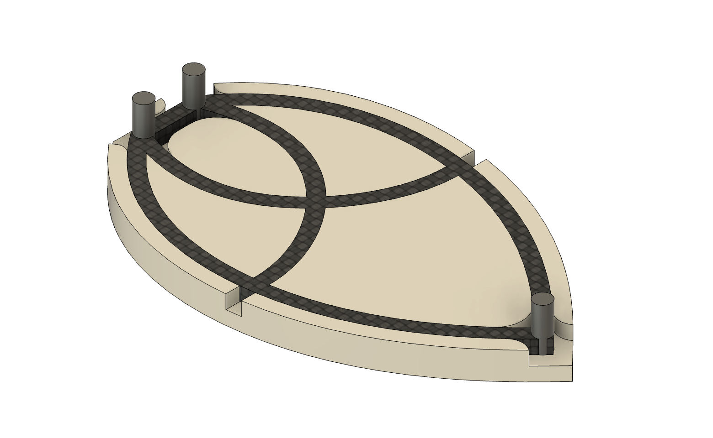
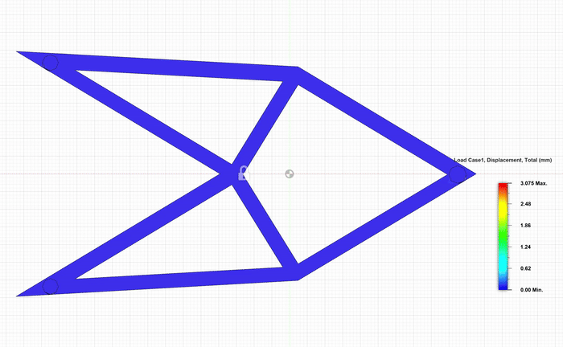
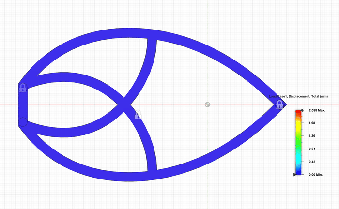
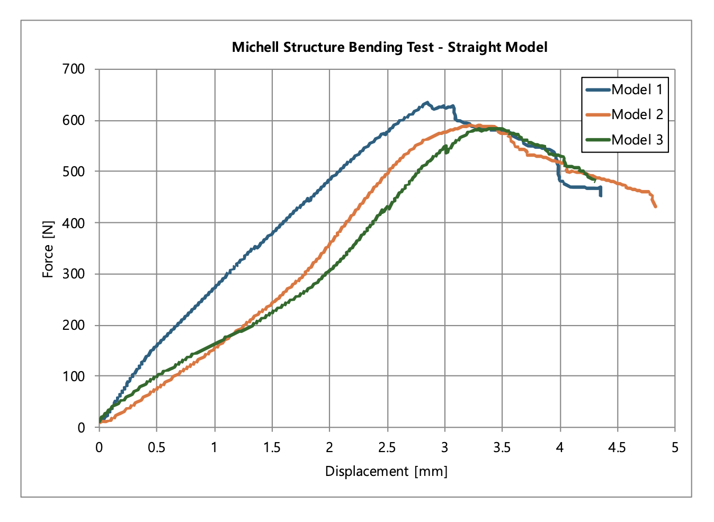
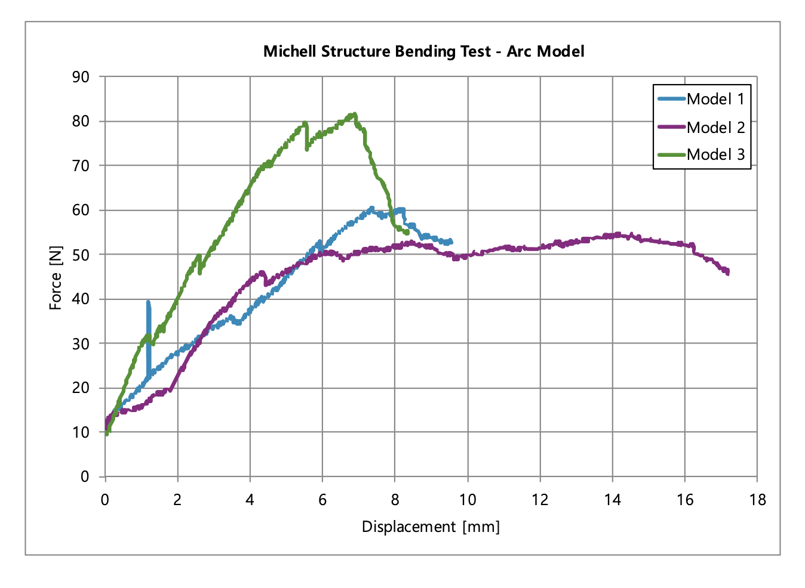
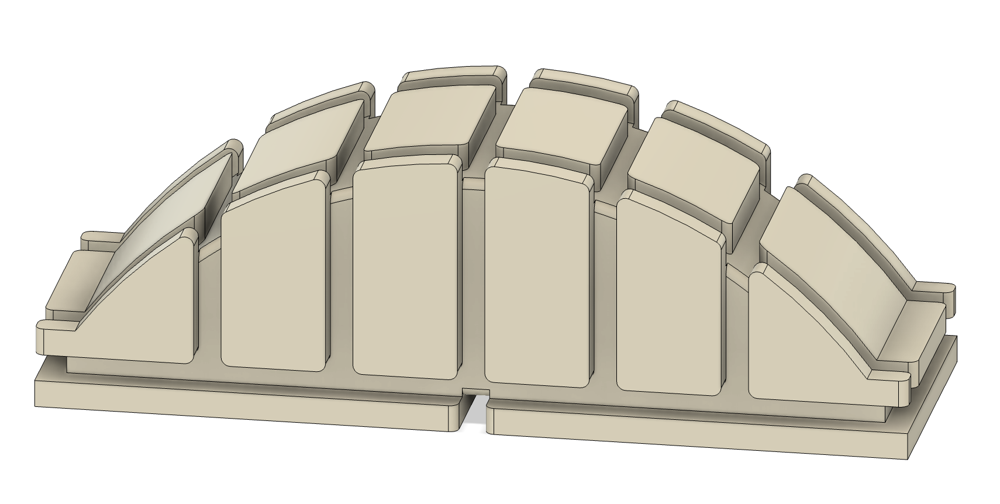

## 📍 Introduction

### Project Introduction
**tapeWinder** is a project focused on the design, fabrication, and testing of composite structures using prepreg tape winding.
The process began with initial structural sketches, followed by the design of custom winding molds.
These molds were 3D printed using water-soluble Aquaprint filament.
Prepreg tape was then wound onto the molds, and the resulting prototypes were evaluated to identify opportunities for improving structural performance.
After refining the designs, the final models underwent CAE simulations and real-world bending tests to verify their performance.

## 💡 Preview

### are bridge model

### michell models

## 📊 Results

### CAE simulations

### bending test results

## 🔍 Improvement plan

- Bridge model with grooves along the top

## ⚒️ Tools
- **Fusion 360**: CAD modeling, CAE simulations
- **Aquaprint filament + 3D printer**: Mold fabrication
- **Prepreg tape**: Composite winding material  
- **Mechanical test setup**: Bending test validation

## 👩🏻‍💻 Author
Eunsori Cho, [@solheeing](https://github.com/solheeing)
